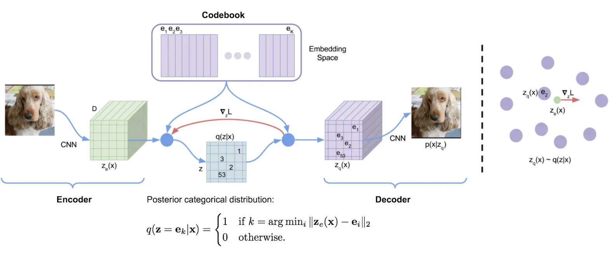
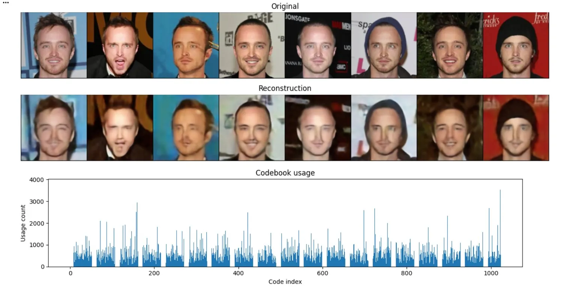

# VQ-VAE — Neural Discrete Representation Learning in PyTorch

A clean, from-scratch implementation of **Vector Quantized Variational Autoencoder** trained on CelebA faces at 256×256 resolution.

> van den Oord, A., Vinyals, O., & Kavukcuoglu, K. — *Neural Discrete Representation Learning*, NeurIPS 2017.

---

## Results


Codebook utilization after training — all 1024 codes active, no collapse:

You can also have a look at original faces and reconstructions made after training (first 5 epoch results)


---

## How it works

```
Image → Encoder → z_e → VectorQuantizer → z_q → Decoder → Reconstruction
                              ↕
                         Codebook (K × D)
                    nearest neighbour lookup
                    EMA update (no aux loss)
```

The key idea: the encoder output `z_e` is replaced by the nearest codebook entry `z_q` before the decoder. Since argmin is not differentiable, gradients are copied straight through from decoder to encoder (straight-through estimator). The codebook itself is updated via **Exponential Moving Average** — no extra loss term needed.

**Dead code reset** — every 50 steps, unused codes are reinitialized from random encoder outputs, preventing codebook collapse.

---

## Repo structure

```
vq-vae/
├── config.py           # All hyperparameters
├── dataset.py          # CelebAHF dataset + DataLoader
├── train.py            # Training loop with checkpointing & resume
├── prepare_data.py     # data preprocessing script for dataloaders to work normally
├── download_data.py    # Script to download data properly
├── visualize.py        # Reconstruction grid + codebook histogram
├── vram_check.py       # Peak VRAM sanity check before full run
├── vqvae/
│   ├── __init__.py
│   ├── encoder.py      # EncoderBlock, EncoderModule
│   ├── quantizer.py    # VectorQuantizer (EMA + dead-code reset)
│   ├── decoder.py      # DecoderBlock, Decoder
│   └── model.py        # VQ_VAE + vq_vae_loss
├── requirements.txt
└── assets/             # Result images for README
```

---

## Architecture

### Encoder
Four strided conv blocks `(3 → 128 → 256 → 256 → 512)`, each with Conv2d (stride=2) + BatchNorm + ReLU + residual conv. A final 1×1 conv projects to `codebook_dim`. Input 256×256 maps to a 16×16 spatial grid of 256-dim vectors.

### Vector Quantizer
Each of the 16×16 = 256 spatial positions is independently snapped to the nearest of K=1024 codebook entries via L2 distance. The codebook is updated with EMA (decay=0.99) — equivalent to an online k-means, but more stable than the original loss-based update.

### Decoder
Mirror of the encoder: 1×1 projection, four nearest-neighbour upsample + conv blocks `(512 → 256 → 256 → 128 → 128)`, final 3×3 conv → Tanh.

---

## Quickstart

```bash
git clone https://github.com/shakhsm123/VQ-VAE-PyTorch-Implementation
cd VQ-VAE-PyTorch-Implementation
pip install -r requirements.txt
```

```bash
# Sanity check VRAM before committing to a full run
python vram_check.py


# download data and preprocess it
python download_data.py
python prepare_data.py


# Train (saves checkpoints/last.pt and checkpoints/best.pt)
python train.py


# Visualize reconstructions from best checkpoint
python visualize.py --checkpoint checkpoints/best.pt
```

---

## Config

All hyperparameters live in `config.py`. Key ones:

| Parameter | Default | Notes |
|---|---|---|
| `codebook_size` | 1024 | Number of codebook entries K |
| `codebook_dim` | 256 | Dimension D of each entry |
| `commitment_beta` | 0.25 | Weight on commitment loss |
| `ema_decay` | 0.99 | EMA decay for codebook update |
| `dead_code_interval` | 50 | Steps between dead-code resets |
| `batch_size` | 64 | ~6 GB VRAM on H100 |
| `lr` | 3e-4 | Adam, no scheduler |
| `epochs` | 100 | ~2h on H100 with 20k images |

---

## Checkpointing & Resume

`train.py` saves `checkpoints/last.pt` after every epoch and `checkpoints/best.pt` whenever val loss improves. To resume a crashed run:

```bash
python train.py   # automatically detects and resumes from checkpoints/last.pt
```

Loss history is saved to `checkpoints/losses.json` at the end of training.

---

## Requirements

```
torch>=2.0
torchvision>=0.15
datasets
huggingface_hub
matplotlib
numpy
```
